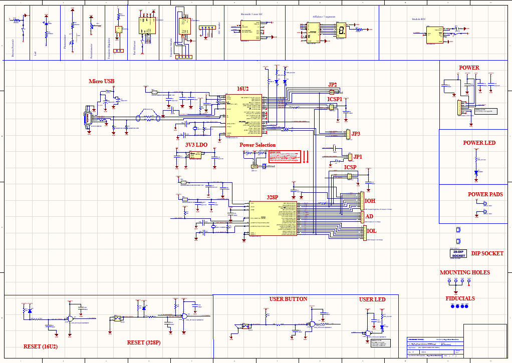

# Project Arduino_Uno board 

The PCB is based on an Atmega 328P. It is connected to various components in order to use the I2C, SPI and programmable pins of the microcontroller. This PCB is a 2-layer board. The aim of this board is to choose a microcontroller available on the market and adapt it to our project needs.

Here's the list of components connected to the Atmega328p microcontroller:

Push button

LED

Photoresistor (analog input)

Potentiometer (analog input)

Accelerometer (I2C)

7-segment display

Clock module (RTC) (I2C)

Ethernet port (SPI)

Bipolar and Mosfet transistors

The software used for the design is Altium Designer. It has been produced by PCB way.

*Project duration: 6 days*

# Table of contents
- [Electronic diagram](#electronic-diagram)
- [PCB Design](#pcb-design)
  

## Electronic diagram

The main element of the PCB is the Atmega 328P. Manufactured by Atmel, it is part of the AVR family, offering a powerful combination of performance and energy efficiency. With its 8-bit RISC architecture, clock frequency of up to 20 MHz and 32 KB flash memory, it is ideally suited to a variety of applications.

Thanks to its features, such as timers, UARTs and communication interfaces, the ATmega328P is a good choice of microcontroller.

To program the Atmega328P, we connected it to a micro-USB and an Atmega 16U2 microcontroller. This allows our board to be programmed directly from Arduino ide via usb.
I have added a power LED for the Atmega328P to indicate when the microcontroller is powered up. There's a power connector containing +5V and +3.3V for powering external components.
I have added a push-button on the reset so that you can manually restart the program on the Atmega328P in the event of a problem.
I have connected a pushbutton to our board. This is connected to a GPIO in order to retrieve its value.  I have added a pull-down resistor to ensure that the low state is maintained when the button is not pressed.
I have added a LED that can be controlled from the board.The clock module, or RTC, allows you to keep the exact time in your project even when it's powered down. The one used in our DS1388 project.
The 7-segment display is connected to a decoder which acts as a link between the Atmega 328P and the display. With this display, numbers from 0 to 9 can be displayed. It's a common-cathode display, so it's connected to ground.

I have added an accelerometer to our I2C board. This is used to indicate when the part is in motion and what its movement is. The accelerometer operates on three axes X, Y and Z.
I have added a connector for the i2C to connect external components to the board and make it more scalable.
A Mosfet transistor enables our board to drive a component with a very high voltage (220V, for example).  It is used in conjunction with an external power supply to power the high-voltage component. It can drive up to two components at the same time.
The bipolar transistor is used to control an external component with current. It is used with an external current source. It's an NPN transistor that can control just one component.
I have added an ethernet port so that our board can communicate via Modbus TCP/IP. The ethernet port is connected via an SPI link.

 

## PCB Design

The PCB has been realized on Altium Designer. It has a dimension of 6.5 cm and a height of 5 cm.  The board's top layer contains most of the components. 

Here's the top layer view of the PCB:

 

Here's the bottom layer view of the PCB:
 

Here is a 3d view of the PCB:
 

## Arduino Factory

 * [More details on this project](https://arduinofactory.fr/carte-pcb-atmega328p/)
  

